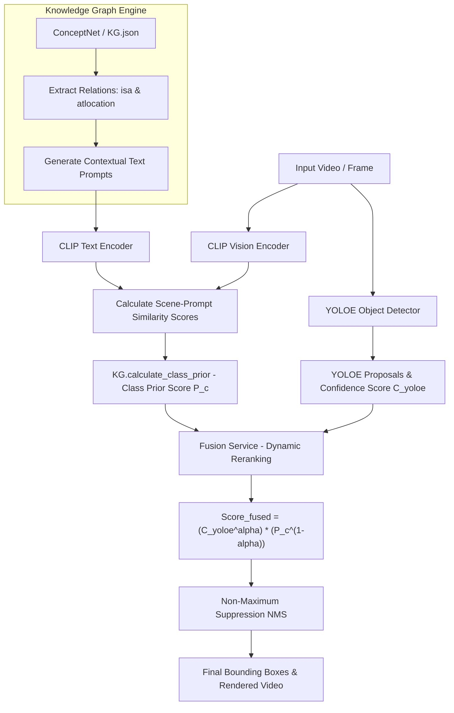

# 🚀 YOLOE + Knowledge Graph + CLIP (YOLOE-KG-CLIP)

An advanced Open-Vocabulary and Zero-Shot Object Detection enhancement framework for autonomous driving and complex vision environments. This research integrates the **YOLOE** promptable object detector with commonsense knowledge from **ConceptNet Knowledge Graph (KG)** and multi-modal scene alignment from **OpenAI CLIP**.

---

## 🔬 Research Architecture & Methodology

Conventional object detectors often struggle with occluded targets, adverse lighting, or open-vocabulary (unseen) object classes due to pure visual appearance dependency. This framework introduces a **Contextual Class-Prior Fusion Mechanism** that uses commonsense relational knowledge and global scene-level semantics to rescue low-confidence object candidates.



### 1. 🎯 YOLOE (Promptable Open-Vocabulary Detector)
* **Role**: Serves as the primary region proposal and object detection module.
* **Mechanism**:
  * Extracts initial bounding boxes and initial confidence scores ($C_{\text{YOLOE}}$) across target object classes.
  * Dynamically conditions text embeddings (`set_classes`) using prompt strings for specified target categories.
  * Operates at a low initial confidence threshold ($\text{CONF\_THRESHOLD} = 0.03$) to maximize recall, ensuring potential object candidates in challenging scenes are captured before fusion.

### 2. 🧠 Knowledge Graph Engine (ConceptNet)
* **Role**: Provides structured commonsense context and environmental prior knowledge.
* **Core Relations**:
  * **`isa`**: Captures hierarchical and categorical taxonomy (e.g., `person` $\rightarrow$ `a photo of a human`, `a photo of a pedestrian`).
  * **`atlocation`**: Captures environmental and spatial co-occurrence contexts (e.g., `car` $\rightarrow$ `a photo of a car in a street`, `a photo of a car in a parking lot`).
* **Processing**: Cleans noisy triples, normalizes concept URIs, and constructs a structured prompt map $M(c)$ for each target class $c$.

### 3. 👁️ CLIP (Vision-Language Alignment)
* **Role**: Evaluates the semantic alignment between the entire image frame context and the KG-generated prompts.
* **Mechanism**:
  * Encodes image frame features $f_I(I)$ using **CLIP Vision Transformer**.
  * Encodes textual prompts $f_T(t)$ for all $t \in M(c)$ using **CLIP Text Encoder**.
  * Computes cosine similarity scores between image features and textual prompt embeddings:
    $$S(I, t) = \frac{f_I(I) \cdot f_T(t)}{\|f_I(I)\| \|f_T(t)\|}$$

### 4. 🔀 Multi-Modal Fusion & Dynamic Reranking
* **Role**: Fuses YOLOE confidence scores with scene-level Class Prior scores derived from KG + CLIP.
* **Mathematical Formulation (Geometric Weighted Fusion)**:
  1. **Class Prior Calculation**:
     Prompt similarity scores are averaged per target class and Min-Max normalized across classes to obtain the contextual Class Prior $P(c) \in [0, 1]$:
     $$P(c) = \text{Normalize}\left(\frac{1}{|M(c)|} \sum_{t \in M(c)} S(I, t)\right)$$
  2. **Geometric Weighted Reranking**:
     For candidate detections with low confidence ($C_{\text{YOLOE}} < \text{LOW\_CONF\_THR}$), the fused confidence score is computed as:
     $$C_{\text{fused}} = C_{\text{YOLOE}}^{\alpha} \times P(c)^{(1 - \alpha)}$$
     where $\alpha$ is the fusion weighting coefficient (default $\alpha = 0.75$).
* **Benefits**:
  * **Object Rescue**: Candidates with lower visual confidence due to partial occlusion or shadow are rescued if the scene context strongly indicates class likelihood.
  * **False Positive Suppression**: Reduces spurious detections that conflict with environmental context.
* **Post-Processing**: Applies Non-Maximum Suppression (NMS, $\text{IoU} = 0.7$) to eliminate redundant bounding boxes.

---

## 🌐 Demo Web Application Overview

To demonstrate and visualize the research model in action, an interactive **Web Research Dashboard** has been developed.

### Web System Architecture
* **Backend**: FastAPI (Python 3.10+, PyTorch, OpenCV, FFmpeg) serving REST API endpoints for video processing and static file delivery.
* **Frontend**: Next.js 16 (React 19, TypeScript, Tailwind CSS, Framer Motion, Recharts) providing a modern dark-themed research dashboard.

### Features
* **Video Upload & Processing**: Drag-and-drop video upload with real-time 5-stage pipeline progress tracking.
* **Side-by-Side Comparison**: Synchronized playback of original input vs. processed detection video.
* **Metrics & Analytics**: Interactive charts showing frame-by-frame precision, recall, mAP, FPS, and class distribution breakdown.

---

## 💻 Demo Web Application Setup & Usage Guide

### 📋 Prerequisites
* **Python**: $\ge 3.10$
* **Node.js**: $\ge 18.0$ (Node.js 20+ recommended)
* **PyTorch**: $\ge 2.6.0$ *(Mandatory for CVE-2025-32434 security compliance)*
* **FFmpeg**: Installed on system PATH (required for H.264 video encoding)

---

### Step 1: ⚙️ Backend Setup & Launch

```bash
# 1. Navigate to backend directory
cd backend

# 2. Create and activate a virtual environment
python -m venv .venv
# On Windows:
.venv\Scripts\activate
# On Linux/macOS:
source .venv/bin/activate

# 3. Install dependencies
pip install -r requirements.txt

# 4. Verify data and model weights
# Ensure yoloe-26m-seg.pt exists in backend/models/
# Ensure KG.json exists in backend/data/

# 5. Start the FastAPI server
uvicorn app.main:app --host 0.0.0.0 --port 8000 --reload
```
* Backend API server: `http://localhost:8000`
* Interactive API Docs (Swagger UI): `http://localhost:8000/docs`

---

### Step 2: 🖥️ Frontend Setup & Launch

```bash
# 1. Navigate to frontend directory
cd frontend

# 2. Install dependencies
npm install   # or pnpm install

# 3. Create local environment file
cp .env.example .env.local

# Ensure .env.local contains:
# NEXT_PUBLIC_API_URL=http://localhost:8000

# 4. Start Next.js development server
npm run dev
```
* Open your browser and navigate to: `http://localhost:3000`

---

### Step 3: 🐳 Containerized Launch (Docker Compose)

```bash
# From project root or backend directory:
cd backend
docker-compose up --build -d
```

---

### 📖 How to Use the Demo Web UI

1. **Upload Video**: Click or drag a video file (MP4, AVI, MOV) into the upload area on the main dashboard (`http://localhost:3000`).
2. **Configure Parameters**: Adjust confidence thresholds or target class modes if desired.
3. **Start Detection**: Click **Start Detection**. The dashboard will display real-time pipeline status through 5 processing stages.
4. **Inspect Results**:
   * Watch the side-by-side original and processed video with bounding box overlays.
   * Review detection summaries, performance charts, and class distribution breakdown.
   * Download processed video output or export metrics reports.

---

## 📂 Project Directory Layout

```text
YOLOE_KG/
├── backend/                  # FastAPI Inference Backend & Pipeline
│   ├── app/
│   │   ├── api/v1/          # REST API endpoints (detect-video)
│   │   ├── services/        # Core pipeline modules
│   │   │   ├── yoloe_service.py   # YOLOE Detector integration
│   │   │   ├── kg_service.py      # Knowledge Graph & Class Prior Service
│   │   │   ├── clip_service.py    # OpenAI CLIP model & prompt encoding
│   │   │   ├── fusion_service.py  # Geometric Weighted Fusion Reranking
│   │   │   ├── nms_service.py     # Non-Maximum Suppression
│   │   │   └── video_service.py   # Frame processing & FFmpeg rendering
│   │   ├── config.py        # Hyperparameters (ALPHA, THRESHOLD, DEVICE)
│   │   ├── pipeline.py      # Pipeline singleton manager
│   │   └── main.py          # FastAPI application entrypoint
│   ├── data/
│   │   └── KG.json          # Knowledge Graph triple store (ConceptNet)
│   ├── models/              # Model weights directory (*.pt)
│   ├── requirements.txt     # Python requirements
│   ├── Dockerfile           # Backend container specification
│   └── docker-compose.yml   # Docker deployment script
├── frontend/                 # Next.js 16 Web Demo Dashboard
│   ├── app/                 # Next.js App Router (Dashboard pages)
│   ├── components/          # React components (Video player, charts, config)
│   ├── lib/                 # API client & helper utilities
│   └── package.json         # Node.js dependencies
└── README.md                 # Project documentation
```

---

## ⚙️ Environment Variables & Configuration

### Backend Configuration (`backend/.env`)
| Variable | Default | Description |
| :--- | :--- | :--- |
| `DEVICE` | `auto` | Execution device (`cuda`, `cpu`, or GPU index `0`) |
| `YOLOE_PATH` | `models/yoloe-26m-seg.pt` | Path to YOLOE model checkpoint |
| `CLIP_MODEL_NAME` | `openai/clip-vit-base-patch32` | Hugging Face CLIP model identifier |
| `CONF_THRESHOLD` | `0.03` | Initial detection confidence threshold |
| `ALPHA` | `0.75` | Weighting factor for YOLOE vs. KG-CLIP fusion |
| `LOW_CONF_THR` | `0.3` | Threshold to trigger geometric reranking |
| `USEFUL_RELATIONS` | `isa,atlocation` | KG relations included for prompt generation |
| `PUBLIC_BASE_URL` | `http://localhost:8000` | Public backend URL for serving processed video files |

### Frontend Configuration (`frontend/.env.local`)
| Variable | Default | Description |
| :--- | :--- | :--- |
| `NEXT_PUBLIC_API_URL` | `http://localhost:8000` | Backend REST API endpoint URL |

---

## 🛡️ Security Advisory (CVE-2025-32434)

The backend enforces a mandatory PyTorch version guard (`_ensure_torch_version_safe`). Due to critical vulnerability CVE-2025-32434 in pre-2.6 `torch.load` deserialization, this system requires **PyTorch $\ge 2.6.0$** to guarantee secure weight loading.

---

## 📜 License & Citation

Research & Thesis Project — Open-Vocabulary Autonomous Driving Object Detection via YOLOE, Knowledge Graph, and CLIP Multi-Modal Fusion.